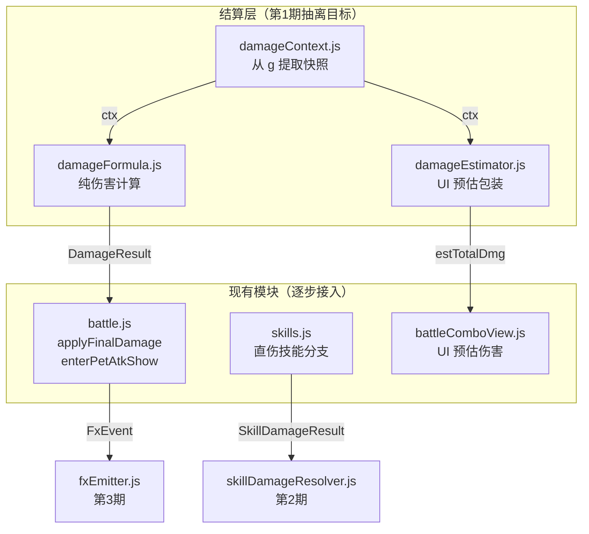

## 产品概述

将战斗页伤害计算逻辑与伤害特效表现逻辑解耦，抽取到独立目录，为后续专门优化伤害特效和战斗渲染做准备。

## 核心功能

- 新建 `js/engine/battle/` 目录，收敛战斗相关逻辑模块
- 抽取伤害结算上下文 (`damageContext`) 和纯公式 (`damageFormula`)，消除 `battleComboView.js` 的公式复制
- 让 `battle.js` 的正式结算和 `battleComboView.js` 的 UI 预估共用同一套公式
- 收口 `skills.js` 直伤链路到统一伤害结果结构
- 将表现触发（飘字、震屏、音效、攻击动画）事件化到 `fxEmitter`
- 最终目标：后续优化伤害特效时只需改 FX 层，不必翻动结算逻辑

## Tech Stack

- 语言：JavaScript (CommonJS 模块系统，与现有项目一致)
- 运行环境：微信小游戏 Canvas 2D 渲染
- 依赖管理：现有 `require/module.exports`，无打包工具

## 实现方案

### 核心策略：分 4 期渐进式重构，先抽公式再抽表现

第 1 期只做"纯公式抽离"，不改变任何副作用逻辑，回归面最小。

### 第 1 期：统一伤害公式（本期执行）

**思路**：把 `applyFinalDamage()` 和 `battleComboView.js` 中重复的伤害计算提成纯函数，两者共用。

**关键模块**：

1. **`damageContext.js`** — 从 `g` 提取结算快照，纯数据对象

- 输入：`g`（Main 实例）
- 输出：`{ combo, pendingDmgMap, pendingHeal, runBuffs, heroBuffs, weapon, enemy, enemyBuffs, heroHp, heroMaxHp, pendingCrit, pendingCritMul, pendingAttrMaxCount, nextDmgDouble, pets }`
- 设计原则：快照一旦生成不可变，公式层不直接碰 `g`

2. **`damageFormula.js`** — 纯伤害计算函数

- `collectBuffMultipliers(ctx)` — 汇总 heroBuffs 各类加成
- `collectWeaponBonuses(ctx, attr)` — 法宝对特定属性的加成
- `calcCritFromCtx(ctx)` — 暴击率/暴击伤害（从已有 `_pendingCrit` 或实时计算）
- `calcDamagePerAttr(ctx, attr, baseDmg)` — 单属性伤害全链路（combo→buff→残血→法宝→克制→防御→暴击）
- `calcTotalDamage(ctx)` — 遍历 pendingDmgMap 汇总 + 回复计算
- 输出结构：`{ totalDmg, attrBreakdown: [{attr, dmg}], isCrit, critMul, heal, isCounter: {attr: boolean}, isCountered: {attr: boolean} }`
- 设计原则：零副作用，不碰 `g`，不调 MusicMgr / DF / g.skillEffects

3. **`damageEstimator.js`** — 给 UI 用的轻包装

- `estimateDamage(g)` — 内部调用 `buildDamageContext(g)` + `calcTotalDamage(ctx)`，不含暴击随机性（暴击取期望或用 `_pendingCrit`）
- 返回 `{ estTotalDmg, extraPct, comboBonusPct }`，直接给 `battleComboView.js` 用

### 接入改动

- **`battle.js`**：`applyFinalDamage()` 内部先调 `buildDamageContext(g)` + `calcTotalDamage(ctx)` 得到纯结果，再执行副作用（扣血、推特效、判死等）。`enterPetAtkShow()` 同理。`calcCrit()` 改为委托 `calcCritFromCtx()`。
- **`battleComboView.js`**：删除行 364-437 的公式复制，改为 `const est = estimateDamage(g)` 直接取 `est.estTotalDmg`。

### 第 2 期：收口技能直伤（后续执行）

- 新增 `skillDamageResolver.js`，统一 `instantDmg` / `instantDmgDot` / `multiHit` / `teamAttack` 的伤害结果结构
- `skills.js` 中 4 个 case 改走 resolver，消除重复的判死/飘字/攻击动画逻辑

### 第 3 期：表现事件化（后续执行）

- 新增 `fxEmitter.js`，统一收口所有表现触发
- 结算层只产出 `DamageResult` + `FxEvent[]`，FX 层消费事件

### 第 4 期：渲染优化（后续执行）

- 对象池、批量绘制、低端机降级等

## 架构设计



## 目录结构

```
js/engine/battle/                  # [NEW] 战斗逻辑收敛目录
├── damageContext.js                # [NEW] 从 g 提取伤害结算快照，纯数据对象
├── damageFormula.js                # [NEW] 纯伤害计算函数，零副作用
├── damageEstimator.js              # [NEW] UI 预估伤害包装，给 battleComboView 用
├── damageResolver.js               # [NEW-第2期] 把公式结果应用到 g，收口副作用
├── skillDamageResolver.js          # [NEW-第2期] 收口 skills.js 直伤链路
├── fxEmitter.js                    # [NEW-第3期] 统一表现触发入口
└── index.js                        # [NEW] 统一导出入口

js/engine/battle.js                 # [MODIFY] applyFinalDamage 改用新公式，保留副作用
js/engine/skills.js                 # [MODIFY-第2期] 直伤分支改走 skillDamageResolver
js/views/battle/battleComboView.js  # [MODIFY] 删除公式复制，改用 damageEstimator
```

## 实现要点

### damageContext.js

- `buildDamageContext(g)` 返回扁平快照对象
- 快照字段从 `applyFinalDamage()` 和 `battleComboView.js` 两处共同引用的 `g` 字段取并集
- 必须包含：`combo, pendingDmgMap, pendingHeal, runBuffs, heroBuffs, weapon, enemy, enemyBuffs, heroHp, heroMaxHp, pendingCrit, pendingCritMul, pendingAttrMaxCount, nextDmgDouble, pets`
- 快照一旦生成就不修改，公式层只读

### damageFormula.js

- 所有函数签名只接收 context 对象，不接收 `g`
- 常量从 `data/balance/combat.js` 和 `data/tower.js` 引入，不在内部硬编码
- `calcDamagePerAttr(ctx, attr, baseDmg)` 的计算链路必须与现有 `applyFinalDamage()` 行 630-687 **逐行对齐**，包括：
- comboMul * comboBonusMul
- debuffAtkReduce (ATK_REDUCE_FLOOR 下限)
- runBuffs.allDmgPct / attrDmgPct
- heroBuffs: allDmgUp / allAtkUp / comboDmgUp / lowHpDmgUp / attrDmgPct
- LOW_HP_BURST（从 combat.js 引入常量，不硬编码）
- weapon 全系列：attrDmgUp / allAtkUp / attrPetAtkUp / comboDmgUp / lowHpDmgUp / stunBonusDmg / weaponBoostPct / ignoreDefPct
- nextDmgDouble (NEXT_DMG_DOUBLE_MUL)
- 克制/被克制：COUNTER_MAP / COUNTER_BY / COUNTER_MUL / COUNTERED_MUL / counterDmgPct
- 敌人防御 + defBuff + ignoreDefPct（weapon 和 heroBuffs 两处）
- critMul
- `calcCritFromCtx(ctx)` 对齐现有 `calcCrit(g)` 逻辑
- `calcTotalDamage(ctx)` 返回 `{ totalDmg, attrBreakdown, isCrit, critMul, heal, counterAttrs, counteredAttrs }`

### damageEstimator.js

- `estimateDamage(g)` = `buildDamageContext(g)` → `calcTotalDamage(ctx)`
- 暴击处理：如果 `ctx.pendingCrit != null` 则用确定值，否则暴击率取期望（`critMul = 1 + critRate/100 * critDmg/100`）
- 返回 `{ estTotalDmg, extraPct, comboBonusPct }` 直接匹配 `battleComboView.js` 现有消费格式

### battle.js 改造

- `applyFinalDamage(g, dmgMap, heal)` 内部重构为：

1. `const ctx = buildDamageContext(g)` — 构建快照
2. `const result = calcTotalDamage(ctx)` — 纯计算
3. 副作用段不变：扣血、推特效、判死等仍直接操作 `g`

- `enterPetAtkShow(g)` 同理：计算部分委托公式层，展示/表现逻辑保留
- `calcCrit(g)` 改为委托 `calcCritFromCtx(buildDamageContext(g))`
- `getComboMul` 继续保留导出（battleComboView 等仍在用）
- **关键**：第 1 期不改任何副作用，只改"怎么算"不改"算完做什么"

### battleComboView.js 改造

- 删除行 364-437 的手动公式复制（约 70 行）
- 替换为：`const est = estimateDamage(g)` 一行调用
- `estTotalDmg` 取 `est.estTotalDmg`
- `extraPct` 取 `est.extraPct`
- `comboBonusPct` 取 `est.comboBonusPct`
- 其余 UI 绘制逻辑完全不变

### 风险控制

- 暴击时序：`enterPetAtkShow()` 提前决定 `_pendingCrit`，`applyFinalDamage()` 消费 `_pendingCrit`，这个时序不在第 1 期改动范围内
- 公式对齐验证：新公式必须与旧公式逐行对齐，建议抽完后在相同输入下对比输出
- 特殊规则不遗漏：poisonChance / bossMirror / execute / comboHeal / onKillHeal 等不属于第 1 期公式抽离范围（它们是副作用段），但注释中需标注清楚
- 回归范围：第 1 期只改 2 个文件（battle.js + battleComboView.js）+ 新增 4 个文件，不动 skills.js / battleHelpers.js / dmgFloat.js / animations.js / render.js

## SubAgent

- **code-explorer**
- Purpose: 在实施过程中快速搜索跨文件的依赖关系和引用点，确保公式对齐无遗漏
- Expected outcome: 确认所有常量引用、所有公式分支、所有调用点的完整映射