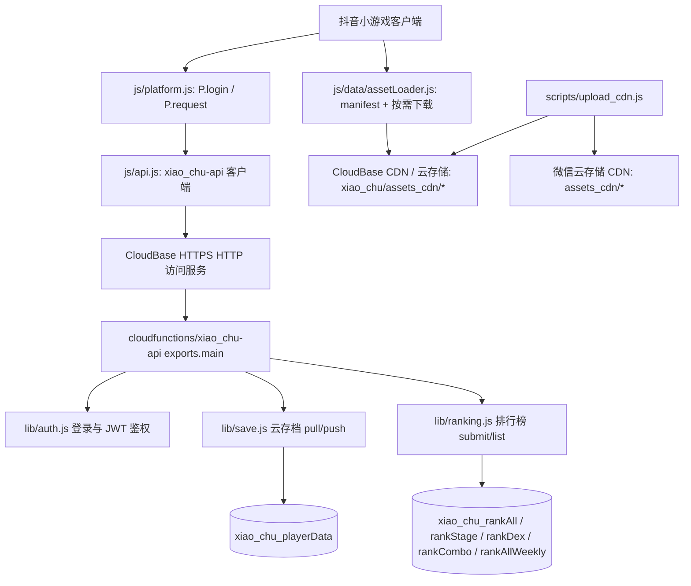

## User Requirements

用户希望在已完成代码基线提交后，先产出一份完整可复核的实施 Plan，确认后再开始开发。当前阶段只面向抖音平台打通线上后端链路，并补齐 CloudBase CDN 上传/下载能力；微信主链路和微信现有 CDN 在未迁移前保持可用。

## Product Overview

为抖音版《灵宠消消塔》接入统一线上后端能力，使抖音玩家能够完成登录识别、云端存档同步、排行榜提交/拉取，以及 CDN 资源下载。游戏在网络异常时仍保持本地存档和包内资源可用，线上能力恢复后再继续同步与按需缓存。

## Core Features

- 抖音端登录后生成稳定玩家身份，用于云存档、排行榜和后续邀请等能力。
- 支持抖音端云存档拉取和上传，避免清缓存、换设备后丢失进度。
- 支持抖音端基础排行榜，包括通天塔、秘境、图鉴、连击和周榜基础展示。
- 支持把瘦包 CDN 资源上传到 CloudBase CDN，并按 `game_key` 增加远端目录前缀，避免与已有 CDN 根目录 `assets` 冲突。
- 迁移期支持原微信云存储 CDN 与 CloudBase CDN 双目标上传，微信未迁移前继续可用，抖音优先使用 CloudBase CDN。
- 保留本地存档和本地资源兜底，后端或 CDN 不可用时不阻断玩家正常游戏。
- 第一阶段不影响微信端现有云开发链路，降低上线风险。
- 后端返回的存档数据保持干净，不把服务端元信息混入玩家本地存档。

## Tech Stack Selection

- 客户端：沿用当前小游戏 JavaScript CommonJS 结构，继续通过 `js/platform.js` 的 `P.login`、`P.request` 适配 `tt.login` 和 `tt.request`。
- 后端：新增 CloudBase 云函数目录 `cloudfunctions/xiao_chu-api/`，采用与 `/Users/huyi/dk_proj/caizhu-rosa/cloudfunctions/caizhu-api` 一致的 `GAME_KEY + HTTP 访问服务 + exports.main(event, context)` 标准方式。
- 数据库：使用 CloudBase 文档数据库，按 `xiao_chu` 前缀隔离玩家存档和排行榜集合。
- CDN/云存储：复用当前 `js/data/assetLoader.js` 的 manifest + 按需下载 + 本地缓存模式，新增 CloudBase CDN 目标；远端对象统一放到 `xiao_chu/assets_cdn/...` 或等价 `game_key` 前缀下，避免占用根 `assets/`。
- 上传脚本：改造当前 `scripts/upload_cdn.js` / `scripts/upload.sh`，支持 `legacy-wechat`、`cloudbase`、`both` 三种上传目标；迁移期默认可双写，后续再切到 CloudBase 单写。
- 鉴权：服务端使用抖音 `code2session` 换取 openid，再签发 JWT；客户端后续请求使用 `Authorization: Bearer <token>`。
- 配置：通过环境变量管理 `GAME_KEY`、JWT 密钥、抖音 AppID/Secret、Token TTL、存档大小上限、CloudBase EnvId、CDN 前缀和上传目标，不把密钥写入仓库。

## Implementation Approach

第一阶段优先复用 `caizhu-rosa` 已验证的标准化后端形态，而不是继续扩展当前 `server/` 的 Express/Mongo 方案。当前项目抖音端已经通过 `js/api.js`、`js/data/cloudSync.js` 和 `js/data/rankingService.js` 具备 HTTP 接入雏形，CDN 也已有 `js/data/assetLoader.js`、`js/data/cdnConfig.js`、`scripts/upload_cdn.js` 的微信云存储实现。因此改造重点是新增 CloudBase 业务 API、切换客户端 API 地址与协议、修正登录失败和数据污染风险，并把 CDN 资源上传/下载链路扩展为 CloudBase 可用且与微信存量不冲突。

关键技术决策：

1. **采用 CloudBase Event Function + HTTP 访问服务**

- `caizhu-api` 当前是 `exports.main(event, context)` 形态，并通过 `lib/http.js` 解析 HTTP 事件、处理 CORS 和路径前缀。
- 该方式更贴近现有参考项目，不引入端口 9000 的 HTTP Function 运行时，改造成本和部署风险更低。

2. **保留微信端现状**

- `cloudSync.js` 中微信端继续走 `P.cloud.database()`、`getOpenid`、`ranking` 等旧云函数。
- 抖音端单独切到 `/xiao_chu-api/*`，避免影响微信线上用户。
- CDN 迁移期微信端默认仍走当前微信云存储 `assets_cdn`，不强制切 CloudBase；上传脚本可双写保证两边资源一致。

3. **存档采用 payload 包裹结构**

- 当前 `xiao_chu` 存档是完整复杂对象，不适合像 `caizhu` 一样只同步多个 localStorage string key。
- 后端保存为 `{ userId, platform, schemaVersion, updatedAt, payload }`，客户端只合并 `payload`，防止 `_id`、`userId`、`platform`、`updatedAt` 等服务端字段污染本地数据。

4. **排行榜先补齐第一阶段必需 action**

- 支持 `submit`、`submitDexCombo`、`submitStage`、`getAll`、`getStage`、`getDex`、`getCombo`、`getAllWeekly`。
- 周榜奖励、礼包、邀请、埋点等运营能力延后，避免首阶段范围过大。

5. **响应格式做兼容适配**

- 新后端标准响应采用 `{ ok: true, data }`。
- `js/api.js` 第一阶段兼容旧 `{ code: 0 }` 和新 `{ ok: true }`，降低联调风险。

6. **CDN 远端路径按 game_key 隔离**

- CloudBase CDN 远端目录不使用根 `assets/`，避免与已有 CDN `assets` 目录冲突。
- 建议远端前缀：`xiao_chu/assets_cdn/manifest.json`、`xiao_chu/assets_cdn/assets/pets/...`、`xiao_chu/assets_cdn/audio_bgm/...`。
- manifest 内的 key 继续保留游戏逻辑路径，如 `assets/pets/pet_e1.png`；只有存储对象路径增加 `game_key` 前缀，这样游戏代码引用资源路径无需大规模改动。

7. **上传链路迁移期双目标支持**

- 当前 `scripts/upload_cdn.js` 使用微信 HTTP API 上传云存储；执行阶段将抽象 upload target，保留原微信目标，并新增 CloudBase 目标。
- 支持 `--target=legacy-wechat`、`--target=cloudbase`、`--target=both`，也可通过 `CDN_UPLOAD_TARGET=both` 配置。
- 双写时每个目标维护独立 manifest 状态，避免用微信 manifest 判断 CloudBase 是否已上传。

## Architecture Design



数据流：

1. 抖音启动后，`cloudSync.init()` 调用 `api.login()`。
2. `api.login()` 调用 `tt.login` 获取 code，并请求 `POST /xiao_chu-api/login`。
3. 后端换取抖音 openid，生成 `dy:<openid>` 用户标识和 JWT。
4. 客户端保存 token 和 userId，后续存档、排行榜请求带 Authorization。
5. 云存档拉取只返回玩家 payload，客户端用现有 `_deepMerge()` 和版本迁移逻辑合并。
6. 排行榜提交按 action 写入对应集合，拉取时返回 list、myRank、periodKey 等当前 UI 已使用字段。
7. CDN 资源由 `assetLoader` 先读 manifest，再按逻辑路径下载并缓存；抖音端读取 CloudBase CDN，微信端在未迁移前继续读取原微信云存储 CDN。
8. 上传脚本扫描 `cdnDirs`，为微信与 CloudBase 分别生成/对比 manifest；CloudBase 实际对象路径增加 `xiao_chu/` 前缀。

## Implementation Notes

- 保持变更边界：第一阶段只新增 `cloudfunctions/xiao_chu-api/`，改造抖音 HTTP 客户端路径，并扩展现有 CDN 配置/上传脚本；不重构微信云函数。
- 登录失败必须显式失败：移除 `api.login()` 当前“失败也 resolve 成功”的行为，防止未登录状态写入匿名云数据。
- 存档大小控制：初始建议 `XIAO_CHU_SAVE_MAX_BYTES=1048576`，后端按 `Buffer.byteLength(JSON.stringify(payload))` 校验，避免超大请求拖垮函数。
- 排行榜性能：榜单列表限制默认 100、最大 200；排名计算尽量按集合和索引字段查询，避免全表拉取后内存排序。
- CDN 前缀隔离：CloudBase 远端前缀必须包含 `GAME_KEY`，例如 `xiao_chu/assets_cdn/`；禁止直接上传到根 `assets/` 或根 `assets_cdn/`。
- CDN manifest 兼容：manifest 里的资源 key 仍使用游戏逻辑路径，下载时由平台 CDN 配置拼接远端前缀，避免重写大量资源引用。
- 上传双写：迁移期上传脚本支持 `both`，且微信与 CloudBase manifest/缓存状态分开保存，防止一侧成功导致另一侧被误判跳过。
- 日志安全：日志只记录 action、userId 前缀、耗时、错误码、CDN 目标和文件数量，不打印完整 token、openid、Secret、完整存档 payload。
- 灰度回滚：`js/api.js` 的 CloudBase base URL 与 `cdnConfig.js` 的 CloudBase CDN base/prefix 集中配置，必要时可快速回切旧抖音云域名或旧 CDN。
- 部署前置：执行阶段使用 CloudBase skill 检查 MCP/CLI、环境、函数访问服务、云存储/CDN 访问方式和安全规则；密钥通过环境变量配置，不提交到仓库。
- 域名风险：如抖音后台不接受默认 CloudBase 函数或 CDN 域名，需绑定已备案自定义域名，并分别加入抖音 request/downloadFile 合法域名。

## Directory Structure Summary

本次实施会新增 CloudBase 统一 HTTP 后端，并小范围改造抖音客户端 API、云同步、排行榜适配层、CDN 配置和上传脚本。

```text
/Users/huyi/dk_proj/xiao_chu/
├── cloudfunctions/
│   └── xiao_chu-api/                         # [NEW] CloudBase 统一业务 API 云函数目录。基于 caizhu-api 标准方式实现 game_key 路径、登录、存档、排行榜。
│       ├── index.js                          # [NEW] 云函数入口。解析 HTTP 事件，路由 /health、/login、/save/pull、/save/push、/ranking/submit、/ranking/list。
│       ├── package.json                      # [NEW] 云函数依赖声明。包含 @cloudbase/node-sdk、jsonwebtoken 等运行依赖。
│       └── lib/
│           ├── config.js                     # [NEW] 读取 GAME_KEY、集合名、JWT 密钥、抖音凭据、存档大小上限等环境变量。
│           ├── http.js                       # [NEW] HTTP 事件解析、CORS、统一响应、错误对象、/xiao_chu-api 前缀剥离。
│           ├── db.js                         # [NEW] 初始化 CloudBase 当前环境数据库，封装按 game_key 获取集合。
│           ├── auth.js                       # [NEW] 抖音 code2session、JWT 签发与鉴权。生产环境禁止 dev openid fallback。
│           ├── save.js                       # [NEW] 云存档 pull/push。保存完整 payload，校验大小、版本、时间戳并清理服务端元字段。
│           └── ranking.js                    # [NEW] 排行榜提交和拉取。支持通天塔、秘境、图鉴、连击、周榜基础能力。
├── js/
│   ├── api.js                                # [MODIFY] 抖音端切换到 CloudBase HTTPS base URL 和 /xiao_chu-api 前缀；兼容 ok/code 响应；缓存 token/userId。
│   └── data/
│       ├── cloudSync.js                      # [MODIFY] 抖音登录成功后保存 userId/openId；适配 save/pull payload；登录失败时正确停用云同步。
│       ├── rankingService.js                 # [MODIFY] 必要时扩展抖音 list 请求参数，传递 scope、realmTier、action，保持微信分支不变。
│       ├── cdnConfig.js                      # [MODIFY] 增加 per-platform CDN 配置：微信 legacy、抖音 CloudBase、game_key 前缀、manifest 路径、上传目标。
│       └── assetLoader.js                    # [MODIFY] 抖音端支持从 CloudBase CDN/HTTPS 下载 manifest 和资源；微信端未迁移前保持原云存储下载。
├── scripts/
│   ├── upload.sh                             # [MODIFY] 增加 --target=legacy-wechat|cloudbase|both 参数，迁移期可双写。
│   └── upload_cdn.js                         # [MODIFY] 抽象上传目标；CloudBase 远端对象路径加 xiao_chu/assets_cdn/ 前缀；分别维护目标 manifest。
└── README.md 或 docs/cloudbase-douyin.md      # [MODIFY/NEW] 记录 CloudBase 环境变量、部署步骤、CDN 上传/回滚、抖音合法域名和验证清单。
```

## CDN Resource Plan

现状：

- 当前 CDN 配置在 `js/data/cdnConfig.js`，`filePrefix` 为 `assets_cdn`，`cdnDirs` 包括 `assets/pets`、`assets/enemies`、`assets/backgrounds`、`assets/equipment`、`assets/intro`、`audio_bgm`。
- 当前加载器 `js/data/assetLoader.js` 基于微信 `P.cloud.downloadFile` 拉取 `manifest.json` 和资源，缓存到用户目录。
- 当前上传脚本 `scripts/upload_cdn.js` 使用微信 HTTP API 上传到微信云存储，manifest 保存在 `assets_cdn/manifest.json`。

目标：

- CloudBase CDN 远端对象统一加 `GAME_KEY` 前缀，建议：`xiao_chu/assets_cdn/`。
- CloudBase manifest 路径：`xiao_chu/assets_cdn/manifest.json`。
- CloudBase 文件路径示例：
- 逻辑路径：`assets/pets/pet_e1.png`
- CloudBase 对象路径：`xiao_chu/assets_cdn/assets/pets/pet_e1.png`
- manifest key：仍为 `assets/pets/pet_e1.png`
- 不上传到 CloudBase 根 `assets/`，也不占用已有 CDN 的 `assets` 目录。

上传策略：

- `legacy-wechat`：保持现有微信云存储上传，供微信未迁移阶段继续使用。
- `cloudbase`：只上传到 CloudBase CDN，供抖音使用。
- `both`：同一次扫描后分别上传到微信和 CloudBase，两个目标分别拉取/生成 manifest，迁移期推荐使用。
- 支持 `--force` 对单目标或双目标全量重传。
- 支持 `--dry-run` 输出待上传/待删除列表，避免误删线上资源。
- 删除策略首阶段默认保守：只上传新增/变更文件，不自动删除远端文件；待 CloudBase CDN 验证稳定后再开启显式 `--delete`。

客户端加载策略：

- 微信端：未迁移前继续使用当前 `P.cloud.downloadFile` + `assets_cdn`。
- 抖音端：优先通过 HTTPS 下载 CloudBase CDN 的 manifest 和资源；下载域名需要加入抖音 `downloadFile` 合法域名。
- 资源逻辑路径不变，仍由 `R` / `AssetLoader.resolveAsset()` 传入 `assets/...`，由 `assetLoader` 按平台拼接远端 CDN 前缀。
- CDN 拉取失败时继续返回 `null` 或本地缓存路径，让现有资源预加载/兜底机制处理，不阻断主流程。

## Key API Contracts

登录：

```
POST /xiao_chu-api/login
{
  "platform": "dy",
  "code": "tt.login code"
}
```

成功响应：

```
{
  "ok": true,
  "data": {
    "token": "jwt",
    "userId": "dy:openid",
    "platform": "dy",
    "gameKey": "xiao_chu",
    "expiresAt": 1234567890000
  }
}
```

存档拉取：

```
POST /xiao_chu-api/save/pull
Authorization: Bearer jwt
```

```
{
  "ok": true,
  "data": {
    "exists": true,
    "schemaVersion": 1,
    "updatedAt": 1234567890000,
    "payload": {}
  }
}
```

存档上传：

```
POST /xiao_chu-api/save/push
Authorization: Bearer jwt
{
  "schemaVersion": 1,
  "updatedAt": 1234567890000,
  "baseRemoteUpdatedAt": 0,
  "payload": {}
}
```

排行榜：

```
POST /xiao_chu-api/ranking/submit
Authorization: Bearer jwt
{
  "action": "submitStage",
  "nickName": "玩家",
  "avatarUrl": "",
  "realmTier": "筑基"
}
```

```
POST /xiao_chu-api/ranking/list
Authorization: Bearer jwt
{
  "tab": "stage",
  "limit": 100,
  "scope": "all",
  "realmTier": "筑基"
}
```

## Environment Variables

```text
GAME_KEY=xiao_chu
XIAO_CHU_JWT_SECRET=<强随机密钥>
XIAO_CHU_TT_APPID=tt64d6126bfab7cc5502
XIAO_CHU_TT_SECRET=<抖音小游戏 secret>
XIAO_CHU_TOKEN_TTL_SEC=604800
XIAO_CHU_SAVE_MAX_BYTES=1048576
XIAO_CHU_CLOUDBASE_ENV_ID=<CloudBase EnvId>
XIAO_CHU_CDN_PUBLIC_BASE_URL=<CloudBase CDN/云存储 HTTPS 访问域名>
XIAO_CHU_CDN_FILE_PREFIX=xiao_chu/assets_cdn
CDN_UPLOAD_TARGET=both
```

## Acceptance Criteria

- 抖音端启动后能完成登录并获得 JWT。
- 后端产生稳定 `dy:<openid>` 用户标识。
- 抖音端可上传云存档，清缓存后可从云端恢复。
- 后端返回的存档不包含 `_id`、`userId`、`platform`、`createdAt`、`updatedAt` 等元字段。
- 抖音端通天塔、秘境、图鉴、连击榜可提交和拉取，空榜不报错。
- 周榜能按当前 periodKey 写入和拉取基础数据。
- CDN 上传脚本支持 `legacy-wechat`、`cloudbase`、`both`，且 `both` 能把同一批 `cdnDirs` 资源同步到两边。
- CloudBase CDN 远端文件均位于 `xiao_chu/assets_cdn/` 或等价 `GAME_KEY` 前缀下，不与已有根 `assets` 目录冲突。
- 抖音端能拉取 CloudBase CDN 的 `manifest.json`，并按需下载至少一张 `assets/pets` 或 `assets/backgrounds` 资源到本地缓存。
- 微信端未迁移前仍能使用原微信云存储 CDN manifest 和资源下载链路。
- 抖音真机 request/downloadFile 通过合法域名校验。
- 微信端仍使用原 `wx.cloud` 链路，功能不受影响。

## Agent Extensions

### Skill

- **cloudbase**
- Purpose: 指导 CloudBase 云函数、HTTP 访问服务、数据库、部署和排障流程，确保符合 CloudBase 标准实践。
- Expected outcome: 形成可部署的 `xiao_chu-api` 后端、明确环境变量、访问服务、CloudBase CDN/云存储配置，并完成部署与资源上传验证清单。

### SubAgent

- **code-explorer**
- Purpose: 在实施前复核当前抖音登录、云同步、排行榜、CDN 加载/上传、微信云函数与微信 CDN 隔离边界，以及参考项目 `caizhu-rosa` 的实现差异。
- Expected outcome: 输出准确影响面，避免遗漏调用点或误改微信主链路。