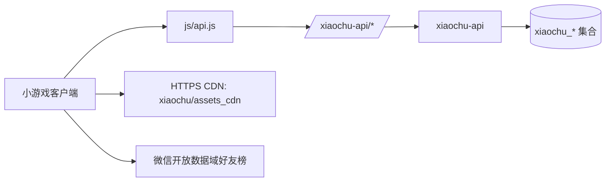

## User Requirements

清理项目中历史遗留的旧后台链路，只保留当前已验证的新统一链路，减少重复逻辑、过期工具和误导性配置。

## Product Overview

项目运行期应只通过统一后端完成登录、存档、排行榜、礼包、邀请、资源下载和埋点上报等核心流程。旧后台相关目录、旧本地管理工具、旧备份导出工具和旧资源回退路径应删除或收口，避免后续误用。

## Core Features

- 删除旧后台云函数与旧管理/备份/迁移工具链。
- 客户端运行期不再保留旧后台调用入口或旧资源下载回退。
- 保留新统一后端、统一资源路径、统一集合前缀和统一配置命名。
- 保留平台原生能力：好友榜、登录授权、分享、广告、游戏圈等不属于旧后台链路的能力。
- 更新文档与注释，确保后续运营和开发只看到新链路。
- 完成清理后进行全量搜索和基础回归验证。

## Tech Stack Selection

- 项目类型：微信小游戏 / 抖音小游戏，CommonJS JavaScript。
- 后端：CloudBase 云函数 `cloudfunctions/xiaochu-api/`，Node.js 运行时，`@cloudbase/node-sdk`。
- 数据：CloudBase 文档数据库，集合统一前缀 `xiaochu_*`。
- CDN：CloudBase COS HTTPS CDN，路径前缀 `xiaochu/assets_cdn/`。
- 客户端网络：`js/api.js` 统一调用 `https://rosa-env-d7grf78r5dbd37323.service.tcloudbase.com/xiaochu-api/*`。
- 必须保留的微信原生能力：`wx.login`、开放数据域好友榜 `wx.setUserCloudStorage` / `wx.getFriendCloudStorage`、用户信息授权、分享、广告等。

## Implementation Approach

本次清理采用“运行期优先、工具链收口、云端验证”的方式推进。先精确区分旧后台链路和微信平台原生能力，再删除旧链路入口，最后用全局搜索与 CloudBase 端验证确保项目只剩新链路。

关键决策：

1. **删除旧独立云函数目录**

- 删除 `cloudfunctions/getOpenid/`
- 删除 `cloudfunctions/initCollections/`
- 删除 `cloudfunctions/ranking/`
- 删除 `cloudfunctions/giftDeliver/`
- 删除 `cloudfunctions/share/`
- 删除或迁移后删除 `cloudfunctions/resetTaskAndWeekly/`
- 保留 `cloudfunctions/xiaochu-api/`

2. **收口 `xiaochu-api` 的迁移管理路由**

- 迁移已完成，`/admin/importBatch`、`/admin/stats`、`/admin/listKeys` 属于迁移验证期能力。
- 建议移除 `cloudfunctions/xiaochu-api/lib/admin.js` 或至少移除公开路由引用，后续建集合/查数通过 CloudBase 控制台或 MCP 完成。
- 同步从文档中删除 `XIAOCHU_ADMIN_KEY` 的常规部署要求，或标记为历史迁移期变量，不作为运行期必需项。

3. **移除客户端旧云能力透传**

- `js/platform.js` 移除 `_mockCloud` 与 `cloud` 字段，避免后续再通过 `P.cloud` 调旧链路。
- 运行期必须搜索确认 `js/` 下没有 `P.cloud`、`wx.cloud.callFunction`、`wx.cloud.database`、`cloud.downloadFile`。

4. **移除 CDN legacy-cloud 分支**

- `js/data/cdnConfig.js` 删除旧 `cloudEnv/cloudBucket/filePrefix/cdnMode` 等旧微信云存储配置，只保留 `cloudbasePublicBaseUrl/cloudbaseFilePrefix/cdnDirs/bundledDirs/ignoreFiles/debugCdn`。
- `js/data/assetLoader.js` 删除 `cloud://` fileID 构造和 `P.cloud.downloadFile` 分支，始终使用 `P.downloadFile({ url })` 下载 `xiaochu/assets_cdn` HTTPS 资源。
- `scripts/upload_cdn.js` 保留 COS REST API 上传逻辑，不再出现 `legacy-wechat`、`both` 或微信 TCB 上传说明。
- `scripts/upload.sh` 更新注释，删除“微信 HTTP API / WX_SECRET”描述。

5. **删除旧微信云开发数据工具链**

- 删除 `tools/lib/wxCloudExport.js`
- 删除或归档 `tools/backup/daily.js`
- 删除 `tools/analysis/export_wx.js`
- 删除 `tools/admin/server.js` 及其前端/配置中旧数据库读取逻辑
- 删除迁移完成后的 `scripts/migrate_batch_to_xiaochu.js`、`scripts/migrate_single_account_to_xiaochu.js`，或移动到 `docs/archive/` 作为不可执行历史记录。用户要求“只保留新链路”，推荐删除可执行脚本。

6. **保留非旧后台能力**

- 保留 `openDataContext/index.js` 和 `js/data/friendRanking.js`，因为好友榜是微信小游戏开放数据域机制，不是旧后台链路。
- 保留 `scripts/generateWxUrlLink.js`，它是微信开放平台 URL Link 工具，不读旧云数据库；若用户后续要求“所有微信后台 OpenAPI 工具也删除”，再单独处理。

## Implementation Notes

- **安全性**：删除迁移 admin HTTP 路由可减少 `XIAOCHU_ADMIN_KEY` 泄露后的风险面。
- **兼容性**：运行期核心功能必须继续走 `js/api.js` + `xiaochu-api`；好友榜继续走开放数据域。
- **性能**：删除 CDN legacy 分支后，资源解析逻辑更短，减少运行时分支判断；下载仍走缓存与 manifest 校验。
- **回滚**：旧链路代码删除前应已在 Git 中有历史提交可回滚；不保留运行期 fallback，避免“半新半旧”状态。
- **部署影响**：删除本地旧云函数目录不等于删除云端资源；需要使用 CloudBase 管理能力确认旧云函数/路由是否仍存在，再按用户确认执行云端删除。
- **日志**：只保留错误日志，不恢复旧 CDN 正常下载刷屏日志。
- **验证**：实现后必须做 `grep` 级别的硬校验，确认旧标识只出现在历史文档或完全不存在。

## Architecture Design

清理后的运行期结构：



边界说明：

- `xiaochu-api` 是唯一业务后端函数。
- `xiaochu_*` 是唯一业务数据集合前缀。
- CDN 只走 HTTPS URL，不走旧云存储 fileID。
- 好友榜是平台原生隔离数据，不进入 `xiaochu-api`。
- 旧微信云开发数据库导出、旧独立云函数、旧本地管理后台不再参与运行期。

## Directory Structure Summary

本次清理会修改、删除以下文件。最终目标是只保留新链路相关代码与文档。

```text
project-root/
├── cloudfunctions/
│   ├── xiaochu-api/                         # [MODIFY] 唯一保留的新后端函数。移除迁移期 admin 路由或仅保留必要安全接口；继续承载 login/save/ranking/gift/share。
│   │   ├── index.js                         # [MODIFY] 删除 /admin/importBatch、/admin/stats、/admin/listKeys 等迁移验证路由引用；保留运行期路由。
│   │   └── lib/
│   │       ├── admin.js                     # [DELETE/MODIFY] 迁移完成后推荐删除，或改为不导出公开 HTTP 管理能力。
│   │       ├── auth.js                      # [KEEP] 新登录链路。
│   │       ├── config.js                    # [MODIFY] 移除迁移期 ADMIN_KEY 常规运行依赖说明或读取。
│   │       ├── db.js                        # [KEEP] 新数据库访问。
│   │       ├── gift.js                      # [KEEP] 新礼包链路。
│   │       ├── http.js                      # [KEEP] 新 HTTP 入口解析。
│   │       ├── ranking.js                   # [KEEP] 新排行榜链路。
│   │       ├── save.js                      # [KEEP] 新存档链路。
│   │       └── share.js                     # [KEEP] 新邀请链路。
│   ├── getOpenid/                           # [DELETE] 旧获取 openid 云函数，已由 xiaochu-api /login 取代。
│   ├── initCollections/                     # [DELETE] 旧建集合云函数，迁移期能力已完成。
│   ├── ranking/                             # [DELETE] 旧排行榜云函数，已由 xiaochu-api/lib/ranking.js 取代。
│   ├── giftDeliver/                         # [DELETE] 旧礼包云函数，已由 xiaochu-api/lib/gift.js 和 /giftDeliver 兼容路由取代。
│   ├── share/                               # [DELETE] 旧邀请云函数，已由 xiaochu-api/lib/share.js 取代。
│   └── resetTaskAndWeekly/                  # [VERIFY THEN DELETE/MIGRATE] 若云端无定时触发则删除；若仍有定时任务，先迁入 xiaochu-api 或新调度方案。
├── js/
│   ├── platform.js                          # [MODIFY] 删除 P.cloud 与 mockCloud，运行期不再暴露旧云能力入口。
│   ├── api.js                               # [KEEP] 新统一 HTTP API 客户端。
│   ├── data/
│   │   ├── cdnConfig.js                     # [MODIFY] 删除旧 cloud1 配置，只保留新 COS HTTPS CDN 配置。
│   │   ├── assetLoader.js                   # [MODIFY] 删除 legacy-cloud、cloud://、P.cloud.downloadFile 分支，只保留 HTTPS 下载。
│   │   ├── cloudSync.js                     # [MODIFY] 清理“云函数/旧链路”注释，确认只走 api.js。
│   │   ├── storage.js                       # [MODIFY] 更新存储架构注释，删除“微信用 wx.cloud”旧表述。
│   │   ├── inviteSync.js                    # [MODIFY] 更新注释，确认只走 xiaochu-api。
│   │   └── friendRanking.js                 # [KEEP] 微信开放数据域原生好友榜，保留 xiaochu_* KV 命名空间。
│   └── ...
├── openDataContext/
│   └── index.js                             # [KEEP] 微信开放数据域好友榜，不属于旧后台链路。
├── scripts/
│   ├── upload_cdn.js                        # [MODIFY] 保留 COS REST API 上传；删除 legacy/both/微信 TCB 上传描述。
│   ├── upload.sh                            # [MODIFY] 更新注释为 COS 上传，不再提 WX_SECRET。
│   ├── loadWxSecret.js                      # [MODIFY/RENAME] 改为通用 env loader；若只剩 CDN 上传，可删除 loadWxSecret。
│   ├── migrate_batch_to_xiaochu.js          # [DELETE] 全量迁移已完成，删除可执行旧数据迁移工具。
│   └── migrate_single_account_to_xiaochu.js # [DELETE] 单账号迁移已完成，删除可执行旧数据迁移工具。
├── tools/
│   ├── lib/wxCloudExport.js                 # [DELETE] 旧微信云数据库导出模块。
│   ├── backup/daily.js                      # [DELETE] 旧微信云数据库每日备份脚本。
│   ├── analysis/export_wx.js                # [DELETE] 旧微信云数据库分析导出入口。
│   └── admin/server.js                      # [DELETE] 旧微信云数据库本地管理后台。
├── docs/
│   └── cloudbase-xiaochu.md                 # [MODIFY] 更新为迁移完成后的新链路说明；删除旧迁移/legacy CDN 指令。
├── README.md                                # [MODIFY] 更新为“仅保留 xiaochu-api 新链路”的项目说明。
└── .gitignore                               # [MODIFY] 删除不再存在的旧工具 ignore 项，保留 secret、manifest、临时数据忽略。
```

## Verification Plan

实现后必须完成以下检查：

1. 语法检查：

- `node -c` 覆盖 `cloudfunctions/xiaochu-api/**/*.js`
- `node -c` 覆盖运行期 `js/**/*.js`
- `node -c scripts/upload_cdn.js`

2. 旧链路搜索：

- `P.cloud`
- `wx.cloud.callFunction`
- `wx.cloud.database`
- `cloud://cloud1`
- `cloud1-6g8y0x2i39e768eb`
- `636c-cloud1-6g8y0x2i39e768eb-1405519553`
- `api.weixin.qq.com/tcb`
- `wx-server-sdk`
- `loadWxSecret`
- `WX_CLOUD_ENV_ID`

3. 允许保留的例外：

- `wx.setUserCloudStorage`
- `wx.getFriendCloudStorage`
- `wx.login`
- `scripts/generateWxUrlLink.js` 的微信 URL Link OpenAPI，如用户未要求删除。

4. CloudBase 验证：

- `GET /xiaochu-api/health`
- 登录、存档拉取、存档推送、排行榜、礼包、邀请基础接口。
- 检查云端旧函数/旧 HTTP 路由是否仍存在，确认后删除或禁用。

5. Git 验证：

- `git status --short`
- 提交前扫描密钥，确保不提交 `.cdn_secret`、`WX_SECRET`、`TENCENTCLOUD_SECRET_KEY`、`XIAOCHU_ADMIN_KEY` 等。

## Agent Extensions

### Skill

- **cloudbase**
- Purpose: 指导 CloudBase 云函数、数据库、存储和资源清理的正确边界，避免误删微信平台原生能力。
- Expected outcome: 形成只保留 `xiaochu-api` 与 `xiaochu_*` 的新链路方案，并完成云端验证/部署策略。

### SubAgent

- **code-explorer**
- Purpose: 跨目录扫描旧链路引用、旧云函数、旧工具脚本和文档残留。
- Expected outcome: 输出可删除/可保留/需迁移的准确清单，避免漏删或误删。

### Integration

- **tcb**
- Purpose: 验证 CloudBase 云端函数、HTTP 路由、数据库集合和部署状态。
- Expected outcome: 确认新 `xiaochu-api` 正常，旧云函数/路由可安全下线，清理后线上链路可用。