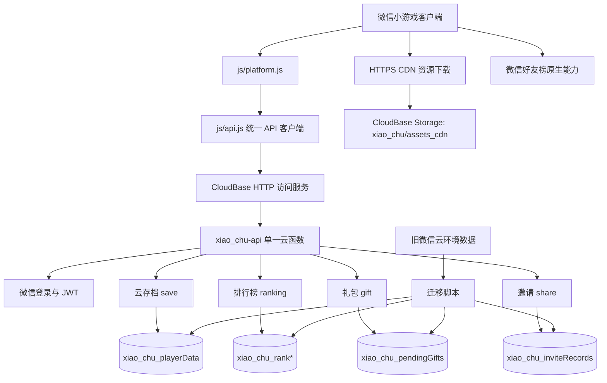

## User Requirements

用户希望调整现有迁移顺序：抖音链路暂未具备完整密钥和审核条件，因此先把当前微信端线上链路切到新的统一线上服务，并完成历史数据搬迁。用户可提供微信应用标识和密钥，要求迁移后微信端登录、存档、排行榜、礼包、邀请和资源下载链路可正常生效。

## Product Overview

将《灵宠消消塔》微信端从旧线上链路迁移到新的统一服务体系，保留玩家现有进度、排行成绩、礼包待领取记录和邀请关系，避免迁移后玩家丢档、榜单清空或资源加载失败。微信链路先稳定后，后续其他平台只需复用同一套服务协议、数据结构和资源路径。

## Core Features

- 微信端登录后获得稳定玩家身份，并继续支持分享邀请参数。
- 历史玩家存档搬迁到新数据结构，返回给客户端时只包含干净玩家数据。
- 历史排行榜数据搬迁并继续支持通天塔、秘境、图鉴、连击和周榜。
- 平台礼包待领取数据和邀请记录迁移，保证旧奖励不丢失。
- 资源下载切到新资源分发目录，保留本地缓存和包内资源兜底。
- 微信好友榜继续保留原生好友榜能力，不强行迁移。
- 密钥只进入运行环境或本地临时环境，不写入仓库。

## Tech Stack Selection

- **客户端**：沿用当前小游戏 JavaScript CommonJS 结构，继续使用 `js/platform.js` 的 `P.login`、`P.request` 作为平台适配入口。
- **统一后端**：继续使用唯一云函数 `cloudfunctions/xiao_chu-api/`，不新增 `login`、`ranking`、`save` 等拆分云函数；在该函数内部扩展微信平台路由。
- **鉴权**：扩展现有 JWT 方案，微信端通过 `wx.login` code 换取 openid 后签发 token；抖音后续复用同一 token、userId、路由协议。
- **数据存储**：使用当前 CloudBase 环境 `rosa-env-d7grf78r5dbd37323` 的文档数据库，目标集合统一为 `xiao_chu_*` 前缀。
- **资源分发**：使用当前 CloudBase 存储 CDN 域名 `726f-rosa-env-d7grf78r5dbd37323-1414200063.tcb.qcloud.la`，目标资源前缀统一为 `xiao_chu/assets_cdn/`。
- **迁移脚本**：复用并扩展现有微信导出工具 `tools/lib/wxCloudExport.js`，新增转换与导入脚本，支持 dry-run、分批导入、幂等重跑和迁移报告。

## Implementation Approach

本次应把“抖音优先、微信不动”的旧 Plan 改为“微信先迁移、抖音复用”。当前已确认 `xiao_chu-api` 已部署但只支持抖音登录，且目标 `xiao_chu_*` 集合尚不存在，CloudBase CDN 目标 manifest 也未上传。因此实施重点是：先补齐统一后端的微信能力，再完成旧微信数据导出、转换、导入，最后把微信客户端从 `wx.cloud` 存档/全服榜链路切到 `/xiao_chu-api/*`。

关键决策：

1. **仍坚持单函数标准**

- 不创建新的业务云函数。
- 微信登录、存档、排行榜、礼包、邀请、迁移管理都作为 `xiao_chu-api` 内部模块或路由。
- 旧微信云函数只作为数据来源和回滚参考，不继续作为主链路。

2. **微信用户 ID 标准化**

- 旧微信 openid 搬迁为 `userId = "wx:<openid>"`。
- 存档、排行榜、礼包、邀请在新集合内统一使用 `userId` 或规范化后的 `uid`。
- 客户端 `cloudSync.getOpenid()` 仍可返回微信原始 openid，保证分享 query 兼容；服务端再归一化。

3. **数据搬迁先备份后导入**

- 先从旧微信环境 `cloud1-6g8y0x2i39e768eb` 导出完整集合。
- 迁移集合至少包括：`playerData`、`rankAll`、`rankAllWeekly`、`rankStage`、`rankDex`、`rankCombo`、`pendingGifts`、`inviteRecords`。
- 导入目标为：`xiao_chu_playerData`、`xiao_chu_rankAll`、`xiao_chu_rankAllWeekly`、`xiao_chu_rankStage`、`xiao_chu_rankDex`、`xiao_chu_rankCombo`、`xiao_chu_pendingGifts`、`xiao_chu_inviteRecords`。
- 迁移脚本必须支持 dry-run、分页、并发限制、失败重试、计数校验和抽样校验。

4. **微信好友榜保留微信原生能力**

- `wx.setUserCloudStorage`、`wx.getFriendCloudStorage` 和开放数据域是微信专属能力。
- 这些不迁移到统一后端；只迁移云存档、全服榜、周榜、礼包、邀请和 CDN 资源。

5. **CDN 先上传再切客户端**

- 当前 `js/data/cdnConfig.js` 仍指向旧微信云环境和 `assets_cdn` 根前缀。
- 需先把资源上传到 `xiao_chu/assets_cdn/manifest.json` 与对应文件，再修改 `assetLoader` 通过 HTTPS 下载 manifest 和资源。
- `manifest` 内 key 继续保留逻辑路径，如 `assets/pets/pet_e1.png`，避免大规模改资源引用。

6. **后续抖音会更简单**

- 微信切通后，统一后端、统一数据结构、统一 CDN、统一客户端 API 都已验证。
- 抖音后续只需补齐 `XIAO_CHU_TT_APPID`、`XIAO_CHU_TT_SECRET` 和合法域名，继续使用同一套 `xiao_chu-api` 协议。

## Implementation Notes

- 先暂停“微信保持旧链路不动”的旧 Plan 约束，更新文档为“微信先迁移，抖音后复用”。
- `WX_APPID`、`WX_SECRET`、`XIAO_CHU_JWT_SECRET`、迁移管理密钥必须只配置到环境变量或本地临时文件，禁止提交。
- 迁移前必须导出旧数据快照，导出文件进入本地备份目录，不覆盖历史备份。
- 迁移导入必须幂等：重复执行不应产生重复存档、重复排行榜记录或重复礼包记录。
- 排行榜查询需加索引或按现有集合排序字段设计，避免大集合全表扫描。
- 客户端切换应集中在 `js/api.js`、`cloudSync.js`、`rankingService.js`、`assetLoader.js`，避免无关重构。
- 礼包发货回调迁移后，需要同步更新微信后台消息推送 URL，否则新礼包不会进入新集合。
- 迁移验证通过前保留旧微信云函数和旧集合，不删除旧资源，便于回滚。
- 默认 CloudBase 测试域名用于验证即可，正式上线需配置微信 request/downloadFile 合法域名。

## Architecture Design



## Directory Structure Summary

```text
/Users/huyi/dk_proj/xiao_chu/
├── cloudfunctions/
│   └── xiao_chu-api/
│       ├── index.js
│       │   # [MODIFY] 增加微信登录、礼包、邀请、迁移管理路由；继续保持唯一函数入口。
│       └── lib/
│           ├── config.js
│           │   # [MODIFY] 增加微信 APPID/SECRET、管理密钥、CDN 前缀等环境变量读取。
│           ├── auth.js
│           │   # [MODIFY] 支持 platform=wx 的 jscode2session；保留 dy 逻辑。
│           ├── save.js
│           │   # [MODIFY] 兼容 wx:<openid> 用户，支持迁移后存档拉取与上传。
│           ├── ranking.js
│           │   # [MODIFY] 兼容微信迁移数据，补齐旧榜单字段与去重逻辑。
│           ├── gift.js
│           │   # [NEW] 承接旧 giftDeliver 的 queryPending、markGranted 和消息回调逻辑。
│           ├── share.js
│           │   # [NEW] 承接旧 share 云函数的 recordInvite、claimInvites 逻辑。
│           └── admin.js
│               # [NEW] 受管理密钥保护的一次性初始化/迁移导入辅助路由，迁移后可禁用。
├── js/
│   ├── platform.js
│   │   # [MODIFY] 增加统一 downloadFile 包装，供 HTTPS CDN 下载复用。
│   ├── api.js
│   │   # [MODIFY] 微信和抖音都指向 xiao_chu-api；login 按平台传 wx/dy。
│   └── data/
│       ├── cloudSync.js
│       │   # [MODIFY] 微信端从 wx.cloud 存档改为 api.save；礼包改为 api.gift。
│       ├── rankingService.js
│       │   # [MODIFY] 微信全服榜从 callFunction ranking 改为 api.ranking。
│       ├── cdnConfig.js
│       │   # [MODIFY] 增加 CloudBase CDN 域名、xiao_chu/assets_cdn 前缀和旧链路回滚配置。
│       └── assetLoader.js
│           # [MODIFY] 支持 HTTPS manifest/资源下载；保留本地缓存和旧下载兜底。
├── scripts/
│   ├── upload.sh
│   │   # [MODIFY] 支持 cloudbase/both/legacy-wechat 上传目标。
│   ├── upload_cdn.js
│   │   # [MODIFY] 上传 CloudBase CDN 路径 xiao_chu/assets_cdn，并生成独立 manifest。
│   └── migrate_wx_to_xiao_chu_cloudbase.js
│       # [NEW] 导出、转换、导入旧微信数据，支持 dry-run、批量和校验报告。
├── tools/
│   └── lib/
│       └── wxCloudExport.js
│           # [MODIFY] 支持环境变量 WX_APPID/WX_SECRET，补齐全部迁移集合。
└── docs/
    └── cloudbase-douyin.md
        # [MODIFY] 更新为微信先迁移、抖音后复用，记录密钥、迁移、回滚和验收清单。
```

## Key Data Mapping

- 旧 `playerData`：
- `_openid` → `openId`
- `userId` → `wx:<openid>`
- 玩家字段 → `payload`
- `_updateTime` / `updatedAt` → 新文档 `updatedAt`
- `_id`、`_openid` 等服务端字段不进入 `payload`

- 旧排行榜：
- `_openid` 或 `uid` → `wx:<openid>`
- `rankAll` → `xiao_chu_rankAll`
- `rankAllWeekly` → `xiao_chu_rankAllWeekly`
- `rankStage` → `xiao_chu_rankStage`
- `rankDex` → `xiao_chu_rankDex`
- `rankCombo` → `xiao_chu_rankCombo`
- 周榜保留 `periodKey`

- 旧礼包与邀请：
- `pendingGifts.openid` → 同时保存原始 `openId` 与规范 `userId`
- `inviteRecords.inviter/newUser` → 规范化为 `wx:<openid>`，并保留必要兼容字段

## Acceptance Criteria

- 微信端启动后能通过 `wx.login` 登录 `xiao_chu-api` 并获得 JWT。
- 目标环境存在全部 `xiao_chu_*` 集合，迁移报告计数与旧集合基本一致。
- 老玩家清缓存后可从新服务恢复旧存档。
- 全服榜、秘境榜、图鉴榜、连击榜、周榜能读取旧数据并提交新数据。
- 待领取礼包和邀请奖励在迁移后仍可查询、领取和标记。
- 好友榜仍使用微信开放数据域，授权和展示不受统一后端迁移影响。
- 微信端能下载新 CDN `xiao_chu/assets_cdn/manifest.json` 并加载至少一张远端资源。
- 旧微信云函数和旧集合保留，验证通过前不删除。
- 抖音后续只需补齐抖音密钥和合法域名即可复用同一链路。

## Agent Extensions

### Skill

- **cloudbase**
- Purpose: 指导 CloudBase 单函数路由、数据库集合、云存储 CDN、部署配置和迁移验证。
- Expected outcome: 保证微信迁移仍符合单一 `xiao_chu-api`、`GAME_KEY` 前缀隔离和 CloudBase 标准实践。

### Integration

- **tcb**
- Purpose: 查询和验证 CloudBase 环境、函数、集合、存储、HTTP 访问服务和部署状态。
- Expected outcome: 实施过程中可核对 `xiao_chu-api`、`xiao_chu_*` 集合、CDN 域名与函数环境变量是否真实生效。

### SubAgent

- **code-explorer**
- Purpose: 复核微信旧链路所有调用点、旧集合字段、礼包/邀请/CDN/好友榜边界。
- Expected outcome: 避免漏迁移微信功能，明确哪些能力迁移、哪些微信原生能力保留。