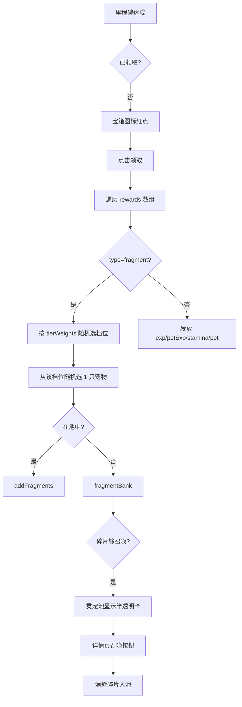

# 宝箱奖励与碎片召唤系统

---

## 一、核心机制设计

### 1. 碎片银行（fragmentBank）

当前碎片只能存储在已入池宠物上（`petPool[i].fragments`）。新增全局碎片银行，存储未拥有宠物的碎片：

```javascript
// storage._d 新增字段
fragmentBank: {},      // { 'w01': 3, 'm05': 7, ... } 未入池宠物碎片
chestRewards: {
  claimed: {},         // { 'lv_1': true, 'tower_10': true, ... }
},
```

碎片发放规则：

- 宠物已在池中 --> `addFragments(petId, count)`
- 宠物未在池中 --> `fragmentBank[petId] += count`
- 宠物入池时 --> 自动迁移 `fragmentBank` 碎片到池内

### 2. 碎片按 tierWeights 分配

每条里程碑奖励配置独立的 `tierWeights`，碎片不再完全随机。分配流程：

```
1. 按 tierWeights 权重随机选中一个档位 (T1/T2/T3)
2. 从该档位所有宠物中随机选 1 只
3. 将本条奖励的全部碎片集中给该宠物（避免分散）
4. 根据宠物是否在池中，走 addFragments 或 fragmentBank
```

复用 `pets.js` 已有的 `PET_TIER` 定义（T1:17只, T2:约54只, T3:约29只）。

### 3. 碎片召唤

消耗碎片召唤未拥有宠物入池：

- T3: 10 碎片
- T2: 15 碎片
- T1: 25 碎片
- 入池后: 1星 Lv.5, 碎片归零

### 4. 可扩展奖励类型

每条里程碑的 `rewards` 是数组，支持以下类型（未来可新增 `item` 等）：

```javascript
// 碎片 — 按权重分配到随机宠物
{ type: 'fragment', count: 8, tierWeights: { T3: 80, T2: 20, T1: 0 } }

// 直接送宠物 — 从指定档位未拥有宠物中随机选一只入池
{ type: 'pet', tier: 'T3' }

// 修炼经验
{ type: 'exp', amount: 200 }

// 宠物经验（共享池）
{ type: 'petExp', amount: 100 }

// 体力
{ type: 'stamina', amount: 30 }

// 预留: 道具（后续扩展）
// { type: 'item', itemId: 'xxx', count: 1 }
```

---

## 二、宝箱里程碑奖励表（完整）

设计原则：前期又密又大，让新手感到资源丰盛；后期逐渐稀疏但单次更有价值。

### A. 修炼等级奖励（Lv 1-10 每级，之后每 5 级，共 21 档）


| ID    | 条件          | 碎片  | tierWeights       | 其他奖励                           |
| ----- | ----------- | --- | ----------------- | ------------------------------ |
| lv_1  | Lv 1        | 8   | T3:90 T2:10 T1:0  | 80 petExp                      |
| lv_2  | Lv 2        | 6   | T3:85 T2:15 T1:0  | 60 petExp                      |
| lv_3  | Lv 3        | 8   | T3:85 T2:15 T1:0  | 100 petExp                     |
| lv_4  | Lv 4        | 8   | T3:80 T2:20 T1:0  | 80 petExp                      |
| lv_5  | Lv 5 (练气期)  | 10  | T3:75 T2:25 T1:0  | 150 petExp + 30 stamina        |
| lv_6  | Lv 6        | 8   | T3:70 T2:30 T1:0  | 100 petExp                     |
| lv_7  | Lv 7        | 8   | T3:65 T2:30 T1:5  | 120 petExp                     |
| lv_8  | Lv 8        | 10  | T3:60 T2:35 T1:5  | 150 petExp                     |
| lv_9  | Lv 9        | 8   | T3:55 T2:35 T1:10 | 120 petExp                     |
| lv_10 | Lv 10       | 12  | T3:50 T2:40 T1:10 | 200 petExp + T3宠物              |
| lv_15 | Lv 15 (筑基期) | 15  | T3:40 T2:45 T1:15 | 300 petExp + 50 stamina        |
| lv_20 | Lv 20       | 18  | T3:30 T2:50 T1:20 | 400 petExp                     |
| lv_25 | Lv 25       | 20  | T3:20 T2:50 T1:30 | 600 petExp                     |
| lv_30 | Lv 30 (金丹期) | 25  | T3:10 T2:50 T1:40 | 800 petExp + 50 stamina + T2宠物 |
| lv_35 | Lv 35       | 22  | T3:10 T2:45 T1:45 | 800 petExp                     |
| lv_40 | Lv 40       | 25  | T3:5 T2:40 T1:55  | 1000 petExp                    |
| lv_45 | Lv 45 (元婴期) | 30  | T3:0 T2:35 T1:65  | 1500 petExp + 50 stamina       |
| lv_50 | Lv 50       | 30  | T3:0 T2:30 T1:70  | 1500 petExp                    |
| lv_55 | Lv 55       | 35  | T3:0 T2:25 T1:75  | 2000 petExp                    |
| lv_58 | Lv 58 (化神期) | 40  | T3:0 T2:20 T1:80  | 2500 petExp + T1宠物             |
| lv_60 | Lv 60       | 50  | T3:0 T2:15 T1:85  | 3000 petExp + 100 stamina      |


趋势：前期 T3 碎片占主导（新手快速获得 T3 宠物），随等级提升逐步向 T1 倾斜。

### B. 肉鸽塔层数奖励（6 档）


| ID       | 条件      | 碎片  | tierWeights       | 其他奖励              |
| -------- | ------- | --- | ----------------- | ----------------- |
| tower_5  | 最高 5 层  | 6   | T3:90 T2:10 T1:0  | 60 petExp         |
| tower_10 | 最高 10 层 | 10  | T3:70 T2:25 T1:5  | 150 petExp        |
| tower_15 | 最高 15 层 | 12  | T3:50 T2:35 T1:15 | 200 petExp        |
| tower_20 | 最高 20 层 | 18  | T3:30 T2:45 T1:25 | 400 petExp        |
| tower_25 | 最高 25 层 | 20  | T3:15 T2:45 T1:40 | 500 petExp        |
| tower_30 | 最高 30 层 | 30  | T3:0 T2:40 T1:60  | 800 petExp + T2宠物 |


### C. 挑战次数奖励（5 档，前期密集）


| ID      | 条件   | 碎片  | tierWeights       | 其他奖励       |
| ------- | ---- | --- | ----------------- | ---------- |
| runs_1  | 首次挑战 | 5   | T3:100 T2:0 T1:0  | T3宠物       |
| runs_3  | 3 次  | 6   | T3:90 T2:10 T1:0  | 80 petExp  |
| runs_5  | 5 次  | 8   | T3:80 T2:20 T1:0  | 100 petExp |
| runs_10 | 10 次 | 12  | T3:60 T2:30 T1:10 | 200 petExp |
| runs_20 | 20 次 | 15  | T3:40 T2:40 T1:20 | 300 petExp |


### D. 灵宠收集奖励（5 档）


| ID      | 条件      | 碎片  | tierWeights       | 其他奖励                    |
| ------- | ------- | --- | ----------------- | ----------------------- |
| pool_3  | 池中 3 只  | 8   | T3:80 T2:20 T1:0  | 100 petExp              |
| pool_5  | 池中 5 只  | 12  | T3:60 T2:30 T1:10 | 200 petExp + 30 stamina |
| pool_10 | 池中 10 只 | 20  | T3:30 T2:45 T1:25 | 400 petExp              |
| pool_15 | 池中 15 只 | 25  | T3:15 T2:45 T1:40 | 600 petExp              |
| pool_20 | 池中 20 只 | 35  | T3:5 T2:40 T1:55  | 800 petExp              |


### 新手前 15 分钟路径估算

- 首局肉鸽：runs_1(5碎+T3宠) + tower_5(6碎) + 战斗掉落
- 到达 10 层死亡/通关：tower_10(10碎) + Lv1~4(30碎) + runs_3(6碎)
- 第 2 局：Lv5(10碎+体力) + runs_5(8碎) + pool_3(8碎)
- 合计：约 83 碎片 + 1只直送T3宠 + ~800 petExp

按每 10 碎片召唤 1 只 T3 估算，新手前 2~3 局约可召唤 3-4 只 T3 + 1 只直送 = 池中约 5-7 只宠物，刚好解锁固定关卡。资源感充足。

---

## 三、固定关卡第 1 章难度上调

前期奖励丰盛后，玩家解锁固定关卡时平均拥有 5-7 只 Lv5-10 的宠物，战力明显高于原设计预期。为避免无脑通关，第 1 章 5 关敌人 HP 和 ATK 上调约 15-20%：


| 关卡           | 敌人  | HP         | ATK    | DEF    |
| ------------ | --- | ---------- | ------ | ------ |
| stage_1_1    | 山灵  | 500->600   | 18->22 | 6->7   |
| stage_1_2 W1 | 火灵兽 | 600->720   | 20->24 | 7->8   |
| stage_1_2 W2 | 炎魔  | 800->960   | 26->30 | 9->10  |
| stage_1_3 W1 | 水蛇精 | 700->840   | 22->26 | 8->9   |
| stage_1_3 W2 | 寒冰蟒 | 900->1080  | 28->32 | 10->11 |
| stage_1_4 W1 | 金甲虫 | 800->960   | 24->28 | 12->14 |
| stage_1_4 W2 | 金刚卫 | 1200->1440 | 34->40 | 14->16 |
| stage_1_5 W1 | 灵藤  | 1000->1200 | 30->35 | 10->12 |
| stage_1_5 W2 | 木灵王 | 1600->1900 | 38->44 | 14->16 |


这样新手带 5-7 只 T3 宠物 (ATK ~12-15) 打第 1 章仍需要认真消除，不会一路碾压。

---

## 四、涉及文件

### 新建文件

**1. `[js/data/chestConfig.js](js/data/chestConfig.js)` — 宝箱配置**

```javascript
const SUMMON_FRAG_COST = { T3: 10, T2: 15, T1: 25 }

const CHEST_MILESTONES = [
  {
    id: 'lv_1', type: 'level', threshold: 1, name: '修炼 Lv.1',
    rewards: [
      { type: 'fragment', count: 8, tierWeights: { T3: 90, T2: 10, T1: 0 } },
      { type: 'petExp', amount: 80 },
    ],
  },
  {
    id: 'runs_1', type: 'totalRuns', threshold: 1, name: '首次挑战',
    rewards: [
      { type: 'fragment', count: 5, tierWeights: { T3: 100, T2: 0, T1: 0 } },
      { type: 'pet', tier: 'T3' },
    ],
  },
  // ... 37 条里程碑（完整表见上文）
]

// 检查条件是否达成
function checkCondition(milestone, storage) {
  switch (milestone.type) {
    case 'level': return storage.cultivation.level >= milestone.threshold
    case 'bestFloor': return storage.bestFloor >= milestone.threshold
    case 'totalRuns': return storage.totalRuns >= milestone.threshold
    case 'petPoolCount': return storage.petPoolCount >= milestone.threshold
  }
}

// 返回已达成但未领取的里程碑列表
function getUnclaimedChests(storage) { ... }

// 按 tierWeights 随机选宠物并分配碎片
function distributeFragments(storage, count, tierWeights) { ... }
```

**2. `[js/views/chestView.js](js/views/chestView.js)` — 宝箱弹窗 UI**

参考 `dialogs.js` 弹窗模式（遮罩 + 居中面板 + 底部关闭）：

- 可滚动的里程碑列表
- 每条显示：里程碑名称 + 奖励图标组 + 领取/已领取状态
- 奖励图标：碎片用珠子图标、petExp 用经验池图标、stamina 用体力图标、pet 用宠物头像
- 每个图标下方显示数量
- 点击"领取"按钮发放奖励并播放音效

### 修改文件

**3. `[js/data/storage.js](js/data/storage.js)`**

版本 `8`，新增字段和方法（详见第一节），修改 `addToPetPool()` 自动迁移银行碎片。

**4. `[js/views/titleView.js](js/views/titleView.js)` — 首页宝箱图标**

位置：右侧与模式切换按钮同 Y 轴（`btnX = W - L.pad - btnW + 4*S, btnY = L.modeSwitchY - 6*S`），有未领取奖励时显示红点。

**5. `[js/input/touchHandlers.js](js/input/touchHandlers.js)` — 宝箱点击**

`tTitle` 中检测宝箱按钮点击 -> `g.showChestPanel = true`。

**6. `[js/views/petPoolView.js](js/views/petPoolView.js)` — 半透明未拥有卡片**

在已入池宠物后面追加 `fragmentBank` 中有碎片的宠物，使用半透明卡片：

- `globalAlpha = 0.5` + 深色遮罩
- 星级区域显示"碎片 X/Y"进度
- 点击进入 petDetail 时设 `g._petDetailUnowned = true`

**7. `[js/views/petDetailView.js](js/views/petDetailView.js)` — 召唤模式**

`g._petDetailUnowned = true` 时：隐藏升级/分解，"升星"替换为"召唤"按钮。

**8. `[js/main.js](js/main.js)` — 弹窗路由**

在 render() 全局弹窗区加入 `chestView.drawChestPanel(this)` 调用。

**9. `[js/data/stages.js](js/data/stages.js)` — 第 1 章难度上调**

上调 `stage_1_1` 到 `stage_1_5` 的敌人 HP +15~~20%、ATK +15~~20%（具体数值见第三节表格）。

---

## 五、数据流




